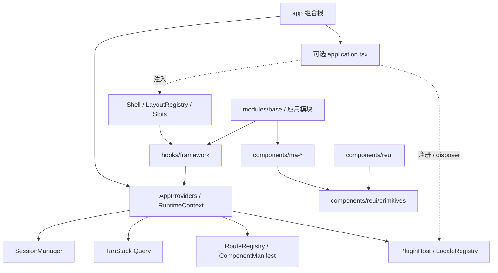

# MineAdmin React 架构

本项目是开源后台应用模板，使用 React 19、TypeScript、React Router 的声明式路由、TanStack Query、Zustand、ReUI 与 Ma 组件。当前不发布 npm SDK。本文说明源码中的公共契约；构建通过不能替代浏览器、后端和部署验收。

## 依赖与组合

`app/main.tsx` 负责挂载，`app/bootstrap.tsx` 负责装配和撤销。`app/runtime.ts` 提供固定字段的运行时，不支持按字符串查找任意服务。`services` 不导入 React、Store 或功能模块；会话服务通过 API、存储、菜单和设置等明确端口访问外部能力。

Router、Shell、页面权限和个人资料组件通过框架 Hook 读取注入的 Session；菜单直接消费同一 Runtime 的 RouteRegistry，动态页面从其 ComponentManifest 解析组件。替换运行时后，认证门禁与页面必须使用同一份会话。默认 Session 的菜单加载端口负责更新默认 Registry；自定义 Session 装配也必须更新配套 Registry。`useSessionStore` 和非 React 的 `hasAuth/hasRole` 保留为默认应用的兼容入口，不用于公共 React 组件的会话读取。旧插件的导航钩子由 App 通过 AppRouter 的 `onNavigate` 接入。

本地应用可提供 `src/app/application.tsx`，导出与 `default-application.ts` 一致的 `setupApplication(runtime) => Promise<disposer>`。Vite 在构建期选择存在的本地入口；没有本地入口时使用空适配器。应用品牌配置、菜单策略和业务模块通过明确的模板导出清单排除，不另建 `app/private` 层。公共依赖检查同时检查类型导入、相对导入、再导出和 glob 边界。

登录页和表单统一由 `modules/base/auth` 提供。应用通过 `registerLoginPageConfig` 配置品牌内容；登录快捷方式只开放 `auth.methods` 一个插槽，扩展组件自行处理第三方按钮、弹窗和回调，并通过公共 Session 完成登录。本项目的飞书接入同样注册该插槽，不替换整张登录页。

## 物理目录

`src` 只保留 `app`、`assets`、`components`、`hooks`、`layouts`、`modules`、`plugins`、`provider`、`router`、`services`、`store`、`types`、`utils`。其中应用自己的 `plugins` 可以缺席，公共模板不携带私有插件。

- React 入口只在 `app/main.tsx`，HTML 直接引用，不再有 src 根级转发文件。
- `components` 只包含 `ma-*` 与 `reui`；通用 UI 只使用 `reui/primitives`，共享辅助在 `reui/utils`。
- 专用组件随所属业务模块，例如创作者解析组件位于 `modules/creator/components`；共享 Logo 和等级图标位于 `assets/images`，保持原文件命名。
- `app` 只负责启动、应用配置与装配；`application.css` 显式补充被 Git 忽略的业务目录的 Tailwind 扫描范围。发布边界由 `scripts/public-files.mjs` 的白名单决定。
- 语言注册与 React 消费集中到 `provider/i18n`，图标索引在 `assets/icons/catalog.json`，图标加载 Hook 跟随 `components/ma-icon`。
- 跨模块 Hook 放在 `hooks/framework` 或 `hooks/shell`；特性与组件专用 Hook 随所属目录，缓存工具在 `services/storage`。
- `utils/cn` 与 `utils/icons` 替代旧 lib；路由异常页在 `router/pages`；类型统一在 `src/types`，不再维护 Vue 自动导入声明。

`scripts/check-source-structure.mjs` 检查实际目录和已退役入口；`check:boundaries` 同时执行目录、组件闭包和 Core 依赖检查。目录名相同不代表职责合规，传递依赖仍独立校验。

## 公共入口

| 能力                    | 入口                                                             | 契约                                                                            |
| ----------------------- | ---------------------------------------------------------------- | ------------------------------------------------------------------------------- |
| 应用 Provider           | `@/provider`                                                     | 在根节点挂载一次 `AppProviders`                                                 |
| Runtime 类型            | `@/provider/runtime/context`                                     | 固定的 session、http、routes、components、plugins、locales、query、telemetry    |
| Framework Hooks         | `@/hooks/framework`                                              | `useSession`、`useAccess`、`useRoute`、`useLocale`、`useTranslate`、Query Hooks |
| Shell Hooks             | `@/hooks/shell`                                                  | 布局、侧栏、标签页和导航上下文                                                  |
| 公共组件                | `@/components/ma-*/index`、`@/components/reui/<组件>`            | 禁止导入其他组件目录作为框架 API                                                |
| UI 原语                 | `@/components/reui/primitives/<组件>`                            | 推荐按组件导入；生成器写入相同目录                                              |
| 访问控制                | `@/provider/access`、`@/services/auth/access`                    | `Access` 组件和纯策略判断                                                       |
| 路由 / 组件注册         | `@/router/registry`、`@/router/manifest`                         | 同一份路由快照；组件 ID 精确匹配                                                |
| 插件协议                | `@/provider/plugins/host`                                        | `PluginManifest`、`PluginContext`、`setup/disposer`                             |
| 会话 / 导航 / HTTP 装配 | `@/provider/session`、`@/provider/navigation`、`@/provider/http` | 不在纯工具或客户端 Store 中装配平台服务                                         |
| 语言注册                | `@/provider/i18n/registry`、`discovery`                          | namespace、冲突检测、默认语言回退                                               |
| 布局与插槽              | `@/layouts/registry`、`@/layouts/slots`                          | 三种布局及命名插槽                                                              |
| 首页注入                | `@/modules/base/dashboard`                                       | `registerDashboardSlot()`，返回 disposer                                        |

`components/reui` 中上游组件的内部辅助文件不是稳定 API。Ma 组件只从各自 `index.ts` 导入；跨功能复用的 Hook 放在 framework/shell 或具体特性中，纯规则不要放进 Hook。

## 会话与数据

`SessionManager` 拥有登录、凭据持久化、并发刷新、会话版本和登出。HTTP 工厂只依赖抽象会话接口，保留现有响应结构、显式 Authorization 和一次重试约定。旧会话的成功响应、401 和刷新结果均不能回写新会话。显式凭据请求不触发管理后台 Token 刷新。

Query key 以 `['session', sessionVersion, module, resource]` 开头，再附加 list 参数或 detail ID。查询默认新鲜期 30 秒、回收期 5 分钟、最多重试一次；鉴权及常见客户端错误不重试，写操作不自动重试。请求必须消费 `AbortSignal`。切换账号或退出时同步取消查询并清空 QueryClient，不能复用上一账号缓存。

会话资料、权限菜单、角色、网站配置以及 Base 的用户、角色、组织、菜单、日志和附件请求共用 QueryClient。`provider/query/resource` 为现有命令式 API 提供适配：读请求按 list/detail key 去重，保留调用时重新获取的语义；写成功后取消旧读并使本资源及显式关联资源失效。单个视图的 AbortSignal 只取消该消费者等待，共享请求继续服务其他消费者；Query 自身的 signal 在失效、退出或账号切换时取消底层请求。新模块优先使用声明式 Query Hooks。

会话装配在 `provider/session`，导航装配在 `provider/navigation`，HTTP 实例装配在 `provider/http`；`services/http` 保持不依赖应用的工厂。路由直接消费 Registry，旧 Route Store 已删除。`store` 只保留标签、页面缓存等客户端状态；会话选择器 `useSessionStore` 读取 SessionManager 的同一份数据，导航状态由 Query 请求和 Registry 更新，不再在 store 中维护第二套路由。命令式页面仍负责自身刷新时机；查询失效不会替代未订阅 Query 的视图刷新。应用私有 API 不会自动迁移，必须主动使用相同 key、取消和失效规则。

## 路由与权限

静态页面拥有其 URL；后端菜单和插件的同路径访问限制叠加到该页面。菜单重复路径合并限制，插件之间的同路径注册拒绝；登录和公开系统路由不可被插件占用。插件注册采用扁平 `RouteDescriptor`；嵌套静态页面仍使用 `AppRoute.children`。

路径身份遵循 React Router 的大小写不敏感语义，参数名称不同不产生第二个 URL 域。protected、guest、public 之间的冲突检查覆盖静态段、参数、可选段和尾部通配符；根级 `*` 只作为未命中时的回退。菜单刷新、静态配置和插件注册都执行相同作用域检查，失败时保留之前的快照。

组件 Manifest 只接受构建期登记的 ID 和显式别名，不做后缀猜测，不导入服务端指定的任意文件。Base 根视图自动登记为稳定 ID，例如 `base/permission/user`；旧视图路径继续作为精确别名。删除别名前必须核实实际后端菜单数据。

permission、role、user 之间是 AND，同类数组内部是 OR。同时提供的 `permission/permissions/auth` 权限码及 `role/roles` 约束分别校验并取交集，别名不会静默覆盖彼此。菜单响应入口兼容旧 `auth/role/user` 字段，将其中的空数组归一化为未配置；显式权限策略中的空数组和非空非法值仍拒绝。旧布尔 `auth` 只保留为元数据，不授予权限或改变路由 scope；public/guest 插件不能携带权限条件。`*` 仅用于角色/权限主体，不作为用户名通配符。客户端判断不能替代后端授权。

## 扩展和布局

插件是构建期可信代码，协议版本为 `coreApi: 1`。Manifest 显式声明 route、locale、dictionary、slot、toolbar 能力；缺少能力时注册失败。初始化失败撤销已登记资源，禁用时先取消 setup，再按相反顺序撤销资源；迟到的异步 setup 不能复活旧安装。额外监听器和定时器必须通过 `onDispose` 或返回 disposer 管理。该机制不提供第三方 JavaScript 沙箱或远程安装。

Host 的 `dispose()` 同时使在途 `enableAll()` 批次失效，旧批次不能继续安装后续插件；撤销后的显式新批次可以独立启用。

布局 ID 为 `classic`、`columns`、`mixed`，未知或禁用 ID 回退 classic。布局只更换导航组合，页面内容保持在共同的 Outlet 中；路由、会话、权限、标签页和主题共用。Shell 插槽包括 overlays、toolbar、pane，以及登录、账号、通知和设置扩展。插件渲染和匹配异常在各自边界内隔离。

`meta.cache: true` 可选择保留页面实例，最多保留 8 页。React Activity 隐藏页会暂停 Effect；每页通过 React Router 的 `Routes location` 保持独立位置。关闭标签、权限失效、账号切换或达到上限会释放页面；它不是 Vue KeepAlive 的逐项等价实现。iframe 使用同一页面缓存生命周期，默认禁止加载，必须配置精确来源；sandbox 不允许 same-origin 权限，并生成对应 frame-src CSP。

## 国际化和错误

模块默认导出 `{ namespace, messages: { [locale]: { [key]: text } } }`。Base 的 `**/locales/*.ts` 和 Shell 的 `locales/*.ts` 自动发现；插件用注册 API 安装语言包。语言编码可扩展，默认提供 zh_CN、zh_TW、en_US。相同语言、namespace、key 的冲突拒绝，缺失翻译回退 zh_CN，再回退调用方文案或 key。Core 和 Shell 提供默认三语；Base 文案按功能收录于 `locales/ui.ts`，尚未翻译的内容按上述规则回退，不能将它视为全页面三语覆盖。`useTranslate` 消费 Core 语义 key；特性内 `createTextTranslator(namespace)` 使用源文案 key 与 `{0}` 参数，React 组件通过 `useLocaleRevision` 订阅语言变化，memo 中包含语言版本。切换语言更新文案和配置，不通过改变页面 key 卸载正在编辑的表单。

应用、导航、页面、扩展和懒加载分别设置错误边界。Telemetry 只接收 code、module 和 status，不接收原始错误消息、请求体或凭据；默认不上报到外部服务。

## 验证与兼容

`check:framework` 验证公共组件闭包、Core 依赖、Ma 组件和框架行为。`check:bootstrap` 使用空合成存储、阻断网络，验证真实 Vite 启动装配与撤销。`build:public-smoke` 在临时目录中只复制公共清单，复用已安装依赖，执行类型检查和生产构建；CI 还会从锁文件安装依赖。`export:public` 只复制发布白名单到一个全新目录，并生成每个文件的 SHA-256 清单；已有目标目录会拒绝覆盖。`check:public-index` 检查实际 Git 跟踪内容，避免将“构建没有引用”误认为“仓库没有收录”。

兼容入口至少保留一个迁移周期。移除公共入口、改变 Plugin Core API、改变权限语义或破坏已有配置，需要主版本变更或明确迁移记录。旧私有组件入口不属于公共版本承诺，应用引用完成迁移后已经删除。详见 [迁移指南](docs/MIGRATION.md) 和 [扩展示例](docs/EXTENSIONS.md)。
