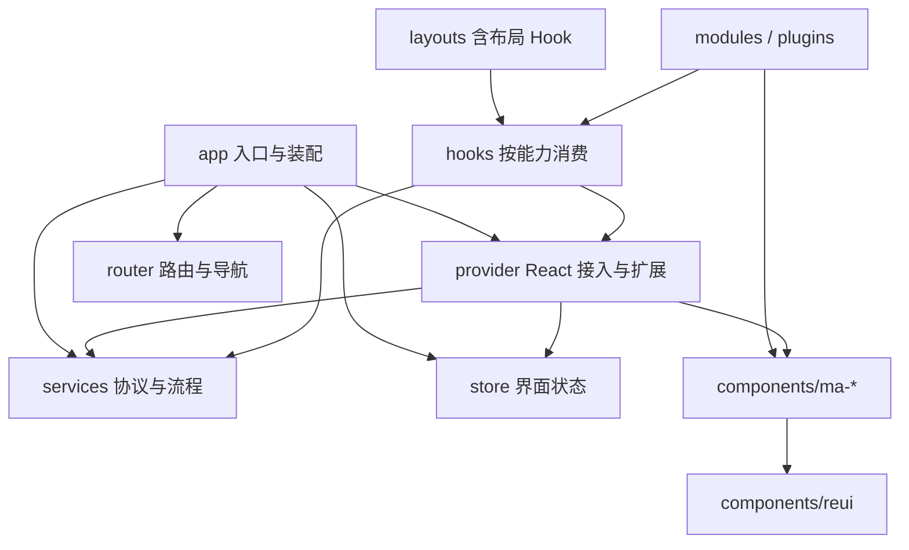

# MineAdmin React 架构

本项目是开源后台应用模板，使用 React 19、TypeScript、React Router 的路由配置、TanStack Query、Zustand、ReUI 与 Ma 组件。当前不发布 npm SDK。本文说明源码中的公共契约；构建通过不能替代浏览器、后端和部署验收。

更新时间：2026-09-28。BioTech 与 MineAdmin-React 都是开源项目；下文的框架和业务划分表示职责及分发范围。

## 依赖与组合

```mermaid
flowchart TD
  App[app 入口与装配] --> Provider[provider React 接入与扩展]
  App --> Services[services 协议与流程]
  App --> Store[store 界面状态]
  App --> Router[router 路由与导航]
  Provider --> Services
  Provider --> Store
  Hooks[hooks 按能力消费] --> Provider
  Hooks --> Services
  Layouts[layouts 含布局 Hook] --> Hooks
  Modules[modules / plugins] --> Hooks
  Modules --> Ma[components/ma-*]
  Provider --> Ma
  Ma --> UI[components/reui]
```

`app/main.tsx` 负责挂载，`app/bootstrap.ts` 负责装配和撤销。`app/runtime/create-runtime.ts` 通过 `createAppRuntime` 装配实例；`app/runtime/instance.ts` 装配默认应用。工厂提供固定字段的运行时，不支持按字符串查找任意服务。`services` 不依赖 React 组件、运行时组合根或功能模块；会话服务使用 Zustand vanilla 保存自身状态，通过 API、存储、菜单和设置等明确端口访问外部能力。

运行时释放时，会话取消在途登录和续期请求，并使尚未完成的认证及用户信息加载结果失效。释放不等于登出，不清除已经完成登录的持久化凭据；销毁后的会话不能再发起认证或写入用户状态。

Router、Shell、页面权限和个人资料组件通过框架 Hook 读取同一 Runtime 的 Session。导航管理器发布统一的菜单与路由结果，动态页面使用该 Runtime 的视图解析器。静态和菜单的同路径权限叠加；导航变化由 `NavigationLifecycle` 调用插件的 `routerRedirect` 钩子。

应用组合根优先使用可选的 `src/app/application.tsx`，没有本地文件时由 `src/app/default-application.ts` 提供空实现。应用品牌配置和菜单策略放在 `app/config`，应用样式放在 `app/styles`。这些 BioTech 应用代码与业务模块由主仓库开源，独立框架导出清单只选择 MineAdmin-React 的可复用内容。公共依赖检查在 TypeScript 解析后检查目标路径，覆盖类型导入、相对导入、别名、再导出和 glob 边界；静态值依赖使用强连通分量检查循环，纯类型循环允许。

运行时页面发现与 Git 收录完全独立：`app/runtime/instance.ts` 在构建时发现 `modules/**/views/` 和 `plugins/**/views/` 下的 `.tsx`、`.jsx` 页面，排除组件、数据、Hook 和测试目录；`router/dynamic-routes.tsx` 负责按文件地址解析页面。菜单组件值必须对应实际页面文件。`.gitignore`、`public-files.mjs` 和提交/推送策略只决定源码收录，不改变运行时页面集合。

登录页和表单统一由 `modules/base/login/views` 提供。应用通过 `runtime.loginPage.register()` 配置品牌内容，通过 `runtime.slots.register()` 注册 `auth.methods` 登录扩展。扩展组件自行处理第三方按钮、弹窗和回调，并通过当前 Runtime 的 Session 完成登录。

## 物理目录

`src` 保留 13 个职责目录，不另加 `framework/core/shared` 总包：

| 目录         | 职责与主要子目录                                                                                                                     |
| ------------ | ------------------------------------------------------------------------------------------------------------------------------------ |
| `app`        | 入口、`bootstrap.ts`、应用装配、`config/`、`styles/`；`runtime/create-runtime.ts` 创建实例，`runtime/instance.ts` 提供默认浏览器实例 |
| `assets`     | 字体、图片、图标和全局样式                                                                                                           |
| `components` | `ma-*`、`reui` 通用组件；`business/` 放跨业务模块复用组件                                                                            |
| `services`   | auth、http、query、i18n、dictionary、navigation、storage、registry、async、errors、telemetry；不调用 React Hook、不读取组件上下文    |
| `provider`   | `app-provider.tsx`、Runtime Context 与组合类型、表格 Query 适配、权限显示组件、插件宿主和扩展注册                                    |
| `store`      | settings、tabs、keep-alive；每项界面状态的纯工厂与订阅 Hook 分文件相邻存放                                                           |
| `hooks`      | auth、query、runtime、i18n、ui，以及 `use-route.ts`、`use-dictionary.ts`                                                             |
| `router`     | 静态/动态路由、页面渲染、页面缓存与 `navigation/` 菜单投影                                                                           |
| `layouts`    | 布局、Shell 上下文、导航与标签栏，布局专用 Hook 放 `layouts/hooks/`                                                                  |
| `modules`    | 基础模块与业务子模块，各自维护 api、locales、views 和按需 hooks                                                                      |
| `plugins`    | 按作者/名称组织具体插件实现                                                                                                          |
| `types`      | `api.ts` 跨模块响应契约和 `env.d.ts` 环境声明                                                                                        |
| `utils`      | 不读取 Runtime 或业务状态的纯工具                                                                                                    |

设置类型在 `store/settings/types.ts`，路由类型在 `router/types.ts`，组合类型在 `provider/runtime/types.ts`。类型跟随能力所有者，不用全局类型文件掩盖反向依赖。

纯 Store 工厂不导入 app、router、Provider 或 Hook。默认首页身份由 `createAppRuntime` 传给 `createSettingsStore`，保留历史设置纠正行为。会话状态由 SessionManager 管理，导航内部状态留在 router/navigation，服务器数据由 Query 管理，不复制到界面 Store。

`app/styles/application.css` 显式扫描被嵌套框架仓库忽略的业务模块和插件。运行时页面发现、Git 收录与框架源码导出分别管理；它们不决定 BioTech 是否开源。

`scripts/check-source-structure.mjs` 拦截旧目录；依赖检查解析相对路径、别名和类型导入，禁止服务依赖 UI、纯 Store 依赖装配层、Provider 硬编码业务模块、通用 UI Hook 读取 Runtime，并检查值依赖循环。Ma/ReUI 组件闭包不能通过应用 Hook 间接依赖 Runtime。组件声明数据端口，Provider 注入实现；例如 `MaDictionaryContext` 和 `TableRequestContext`。

## 公共入口

| 能力             | 入口                                                     | 说明                                                        |
| ---------------- | -------------------------------------------------------- | ----------------------------------------------------------- |
| 创建运行实例     | `@/app/runtime/create-runtime`                           | 仅装配、嵌入入口和测试使用                                  |
| 应用 Provider    | `@/provider`                                             | `AppProviders`                                              |
| Runtime 组合类型 | `@/provider/runtime/types`                               | `AppRuntime`；Context 在相邻的 context.ts                   |
| React 实例绑定   | `@/hooks/runtime`                                        | `useRuntime`、`useRuntimeFactory`                           |
| 会话与权限       | `@/hooks/auth`、`@/provider/access`                      | Hook 与 Access/PermissionGate 显示组件分开                  |
| HTTP 与资源 API  | `@/services/http`、`@/services/query`                    | 注入 runtime.http；创建资源 key、读取和失效策略             |
| 查询 Hook        | `@/hooks/query`                                          | `useResourceQuery`、`useQueryTable`、Query Hooks            |
| React 翻译       | `@/hooks/i18n`                                           | useLocale、useTranslate、useTextTranslator、语言订阅        |
| 普通函数翻译器   | `@/services/i18n`                                        | `createTextTranslator(ports, namespace)` 只接收翻译所需端口 |
| 字典订阅         | `@/hooks/use-dictionary`                                 | `useDictStore`；纯注册服务在 services/dictionary            |
| 界面状态         | `@/store/settings`、`@/store/tabs`、`@/store/keep-alive` | 纯工厂与 React 订阅入口                                     |
| 布局 Hook        | `@/layouts/hooks`                                        | useShell、useLayout                                         |
| 组件             | `@/components/ma-*`、`@/components/reui/<组件>`          | 组件内部辅助文件不是稳定 API                                |
| 插件宿主         | `@/provider/plugins`                                     | install(runtime)、注册与撤销                                |
| 应用扩展         | `@/provider/extensions`                                  | Dashboard 插槽、登录页配置                                  |

不提供导出所有能力的全局 Hook 入口。能力内部引用具体实现，对外 index 只提供稳定契约。

## 会话与数据

`SessionManager` 拥有登录、凭据持久化、并发刷新、会话版本和登出。HTTP 工厂只依赖抽象会话接口，保留现有响应结构、显式 Authorization 和一次重试约定。旧会话的成功响应、401 和刷新结果均不能回写新会话。显式凭据请求不触发管理后台 Token 刷新。

Query key 以 `['session', sessionVersion, module, resource]` 开头，再附加 list 参数或 detail ID。查询默认新鲜期 30 秒、回收期 5 分钟、最多重试一次；鉴权及常见客户端错误不重试，写操作不自动重试。请求必须消费 `AbortSignal`。切换账号或退出时同步取消查询并清空 QueryClient，不能复用上一账号缓存。

会话资料、权限菜单、角色、网站配置以及 Base 的用户、角色、组织、菜单、日志和附件请求共用 QueryClient。`services/query/resource` 为现有命令式 API 提供适配：读请求按 list/detail key 去重，保留调用时重新获取的语义；写成功后取消旧读并使本资源及显式关联资源失效。单个视图的 AbortSignal 只取消该消费者等待，共享请求继续服务其他消费者；Query 自身的 signal 在失效、退出或账号切换时取消底层请求。普通 CRUD 默认把资源 API 直接交给 MaProTable；组合多个服务器资源或使用受控表格时再使用 Query Hook。

会话、HTTP、导航和插件由 `app/runtime/create-runtime.ts` 装配。导航状态保存在当前 Runtime 的 Zustand store，路由、菜单、面包屑及标签共同消费该结果；框架 Hook 通过注入上下文读取实例。`store` 中的独立客户端状态包括设置、标签和页面缓存。命令式页面仍负责自身刷新时机；查询失效不会替代未订阅 Query 的视图刷新。业务 API 不会自动迁移，必须主动使用相同 key、取消和失效规则。

普通模块通过 `createApi(runtime)` 返回 API，页面用 `useRuntimeFactory(createApi)` 获取稳定实例。资源 API 的 list 函数携带 `queryOptions(params)`；`provider/query/table-adapter.ts` 直接使用这个资源 key 和 loader，因此请求模式表格、查询 Hook 与资源失效操作共用同一份服务器数据。未提供 queryOptions 的普通 API 继续使用按表格实例隔离的 Query key。不要用匿名包装函数丢弃资源 API 的 queryOptions。

Ma 组件只依赖结构化的请求接口，不直接导入 TanStack 或应用服务。没有应用 Provider 时仍可独立运行；需要字典的独立消费方通过 MaDictionaryContext 提供字典快照、订阅与翻译接口。应用 Provider 按 Runtime 注入字典和语言订阅，不使用全局单例。

## 路由与权限

静态页面和插件页面使用扁平的 `AppRoute` 声明。后端菜单和插件的同路径访问限制叠加；等价路径保留首个代码声明的实现及重定向，菜单补充导航信息。菜单可以嵌套，转换时拍平 URL 并继承祖先权限。根路径、登录路径和根级通配回退由框架处理，不能通过菜单或插件重复注册。

路径身份遵循 React Router 的大小写不敏感语义，参数名称不同不产生第二个 URL 域。具体页面匹配使用 React Router 的静态段、参数、可选段和尾部通配规则。登录页仅供未登录用户访问，其余静态及插件页面要求登录；`useDefaultLayout: false` 只改变布局。菜单请求失败时保留之前的导航快照，缺失视图仅影响对应入口。

视图解析器只从 Vite 构建期发现的文件表加载页面。菜单 `component` 是相对文件路径，例如 `base/user/views/index`，`meta.componentPath` 明确选择 `modules/` 或 `plugins/`。已指定来源时不跨目录查找；未指定来源的历史引用必须唯一命中。详细规则和插件示例见 [路由文档](docs/ROUTING.md)。

permission、role、user 之间是 AND，同类数组内部是 OR。同时提供的 `permission/permissions/auth` 权限码及 `role/roles` 约束分别校验并取交集，别名不会静默覆盖彼此。菜单响应入口兼容旧 `auth/role/user` 字段，将其中的空数组归一化为未配置；显式权限策略中的空数组和非空非法值仍拒绝。旧布尔 `auth` 只保留为元数据，不授予权限或改变登录要求。`*` 仅用于角色/权限主体，不作为用户名通配符。客户端判断不能替代后端授权。

## 扩展和布局

插件是构建期可信代码，入口默认导出 `PluginConfig`，包含 `config`、可选 `views`、`hooks` 和 `install`。自动发现使用实际目录识别插件视图归属，`info.name` 在应用内唯一。安装失败的插件停止提供路由，返回的 disposer 在释放时按相反顺序调用；异步安装在旧运行时释放后完成时，其 disposer 会立即执行。插件自行管理安装过程中的资源，额外监听器和定时器应由返回的 disposer 清理。该机制不提供第三方 JavaScript 沙箱或远程安装。

Host 的 `dispose()` 使在途 `register()` 安装失效。旧安装返回的 disposer 会立即执行，旧插件不能再次发布页面；释放后的显式新注册可以独立执行。

布局 ID 为 `classic`、`columns`、`mixed`，未知或禁用 ID 回退 classic。布局只更换导航组合，页面内容保持在共同的 Outlet 中；路由、会话、权限、标签页和主题共用。Shell 插槽包括 overlays、toolbar、pane，以及登录、账号、通知和设置扩展。插件渲染和匹配异常在各自边界内隔离。

`meta.cache: true` 可选择保留页面实例，最多保留 8 页。React Activity 隐藏页会暂停 Effect；每页通过 React Router 的 `Routes location` 保持独立位置。关闭标签、权限失效、账号切换或达到上限会释放页面；它不是 Vue KeepAlive 的逐项等价实现。iframe 使用同一页面缓存生命周期，默认禁止加载，必须配置精确来源；sandbox 不允许 same-origin 权限，并生成对应 frame-src CSP。

## 国际化和错误

模块默认导出 `{ namespace, messages: { [locale]: { [key]: text } } }`。Base 的 `**/locales/*.ts` 和 Shell 的 `locales/*.ts` 自动发现；插件用注册 API 安装语言包。语言编码可扩展，默认提供 zh_CN、zh_TW、en_US。相同语言、namespace、key 的冲突拒绝，缺失翻译回退 zh_CN，再回退调用方文案或 key。Core 和 Shell 提供默认三语；Base 文案按功能收录于 `locales/ui.ts`，尚未翻译的内容按上述规则回退，不能将它视为全页面三语覆盖。`useTranslate` 消费 Core 语义 key；特性内 `createTextTranslator(ports, namespace)` 使用源文案 key 与 `{0}` 参数，React 组件通过 `useLocaleRevision` 订阅语言变化，memo 中包含语言版本。切换语言更新文案和配置，不通过改变页面 key 卸载正在编辑的表单。

应用、导航、页面、扩展和懒加载分别设置错误边界。Telemetry 只接收 code、module 和 status，不接收原始错误消息、请求体或凭据；默认不上报到外部服务。

## 验证与兼容

`check:framework` 验证公共组件闭包、Core 依赖、Ma 组件和框架行为。`check:bootstrap` 使用空合成存储、阻断网络，验证真实 Vite 启动装配与撤销。`build:public-smoke` 在临时目录中只复制公共清单，复用已安装依赖，执行类型检查和生产构建；CI 还会从锁文件安装依赖。`export:public` 默认从 HEAD 的 Git blob 导出发布白名单，记录 commit 和 SHA-256，不混入本地修改或未提交文件；已有目标目录会拒绝覆盖。`build:public-smoke` 使用同一份 Git 快照。开发中预览当前修改需显式传入 `--working-tree`，此时清单标为工作树来源，不应作为已提交发布的证据。`check:public-index` 检查实际 Git 跟踪内容，避免将“构建没有引用”误认为“仓库没有收录”。

2026-09-28 目录迁移同步更新了工作树内调用方，旧路径已经移除，不提供转发文件。外部消费方需按 [迁移指南](docs/MIGRATION.md) 更新导入；这份工作树迁移记录不代表已发布新版本。HTTP 响应、权限和会话语义保持原约定。插件接入见 [路由与插件示例](docs/ROUTING.md)。

## 实例边界与 API 扩展

`createAppRuntime({ storage, prefix, baseURL, origin, ...ports })` 为会话、HTTP、Query、导航、组件清单、插件、语言注册表、字典和 Shell 插槽提供成套实例。`dispose()` 撤销插件、存储订阅和 Query 会话订阅，取消查询并清除导航。拥有外部实例的调用方应为每个 runtime 提供独占生命周期。

模块的 `api/*.ts` 导出 `createApi(runtime)`；React 使用 `useRuntimeFactory(createApi)`。读取、写入、缓存键和失效必须使用同一个 Runtime，模块不导入默认应用实例。权限回调通过 `usePermission` 在执行时读取当前注入会话；纯列配置接收 `hasAuth` 参数。

用户列表使用 Query 观察缓存，MaProTable 通过受控 `data/loading/error/total` 展示结果并管理搜索、分页、选择。写入后由资源 API 失效当前会话的查询，列表自动更新。其他列表仍兼容命令式请求，迁移时沿用此模式，不在 Ma 基础组件中导入业务 API 或应用 Query 单例。

设置、标签、页面缓存、语言和字典均由 Runtime 持有，订阅 Hook 通过当前 Provider 读取实例。AppProviders 同时隔离主题作用域、Portal 容器和 Toast；共享浏览器存储时须选择合适的前缀，相同前缀会共用持久化缓存键，会话还通过存储事件同步。

## 会话与扩展安全

同源标签页共享存储时，用 `session_id` 区分登录身份；身份变化立即清除旧资料、角色、权限和查询，阻止旧请求及刷新结果回填。同一身份的 token 轮换不会沿用其他账号的权限。HTTP 只允许向配置的 API origin 发送 Authorization，网络钩子修改地址后再次校验；需要调用其他来源时使用独立客户端。

启动依次调用插件的 `hooks.start(config)` 和 `install(runtime)`，当前 bootstrap 不调用 `hooks.setup`。宿主没有安装超时、capability 白名单或 `context.signal`；插件须自行管理异步取消与部分安装失败的清理。HTTP 的 `networkRequest` 钩子单独受 `hookTimeout`（默认 10 秒）和请求 AbortSignal 限制。运行时释放后迟到的安装 disposer 仍会执行；这些生命周期规则不构成沙箱。
